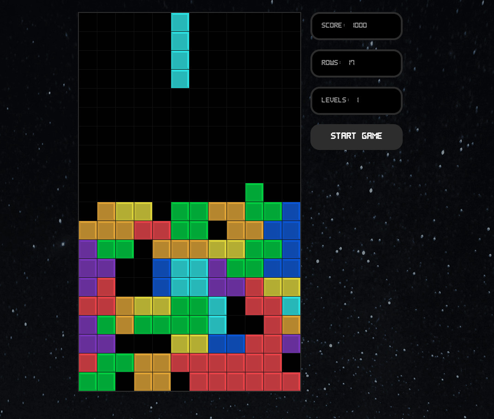
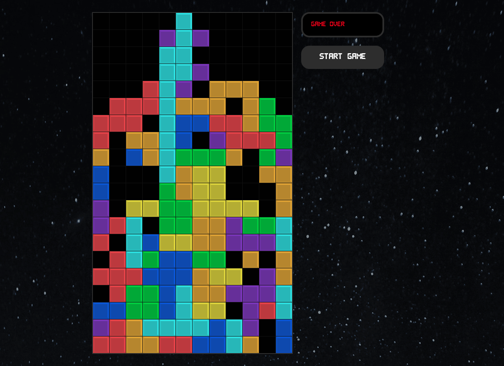

# Tetris
Tetris game done with React + React Webhooks

## Presentational Images
The following section will present some images of the application running

##### Starting Moves

##### Midgame

##### Game Over


## Getting Started
To install the application in your local machine, follow the next steps.

  1. Navigate to a directory of your choosing; this is where your application will be installed. 
  
  2. Clone the repository by running ``` git clone webUrl ``` on your bash, where *webUrl* is the Https hyperlink found in the    *Clone or Download* button.

  3. Get inside the created folder, and run ``` npm install ``` to install the node dependencies onto your local machine.
  
  4. One that is done, you can run ``` npm start ```, and the application will run on your local server.


